```{r setup, include=FALSE}
knitr::opts_chunk$set(echo = FALSE)
```

# День 1

1. Источники пространственных данных: картографическая "основа"

1. Тематические карты: визуализация данных

1. Соединение пространственных данных и статистики

1. Картографические сервисы

---
class: center, middle, inverse
# Источники данных

---

## Базовые картографические данные

### Natural Earth — cверхмелкомасштабные (страны, Россия)

.pull-left[
```{r, out.width = "100%", fig.cap=""}
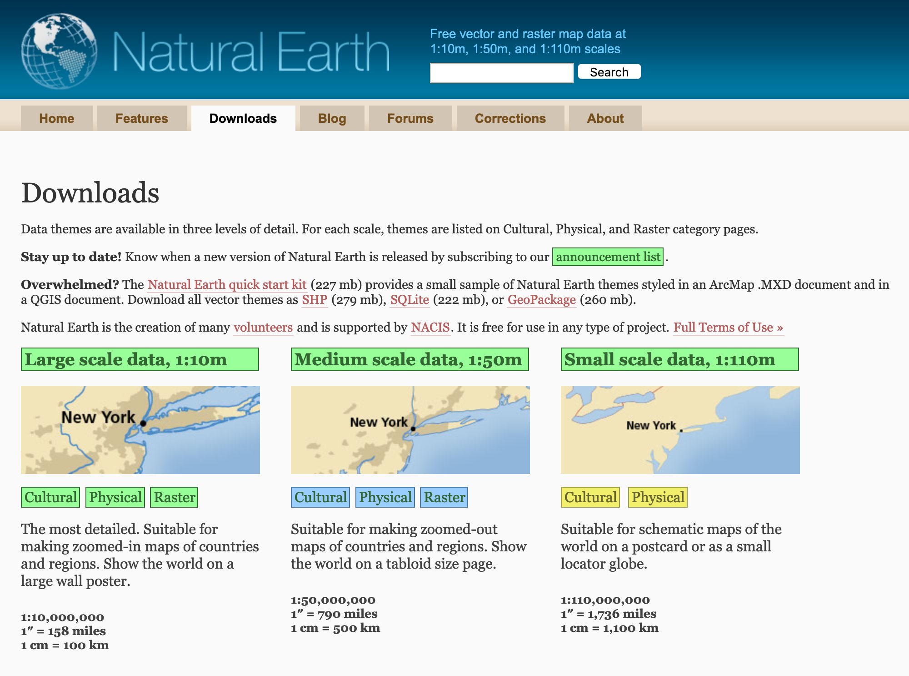
```
]

.pull-right[
- Масштабы 10, 50 и 110 млн

- Подходят для создания карт стран и макрорегионов

- Аккуратные и точные данные для своей детализации

- Локализация на множестве языков
]

[https://www.naturalearthdata.com/](https://www.naturalearthdata.com/)

---

## Базовые картографические данные

### Natural Earth — cверхмелкомасштабные (страны, Россия)

```{r, out.width = "60%", fig.cap=""}
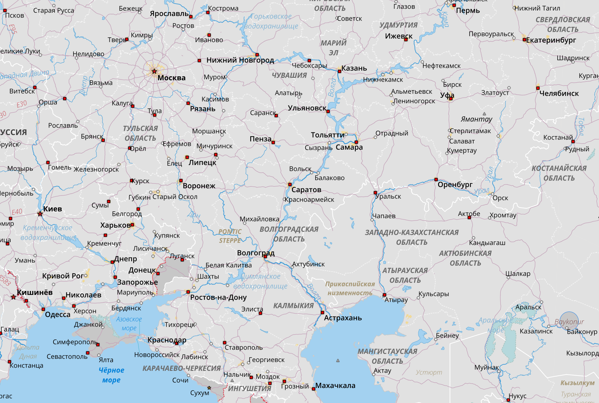
```

---

## Базовые картографические данные

### ВСЕГЕИ — Мелкомасштабные (Россия, крупные регионы)

.pull-left[
```{r, out.width = "80%", fig.cap=""}
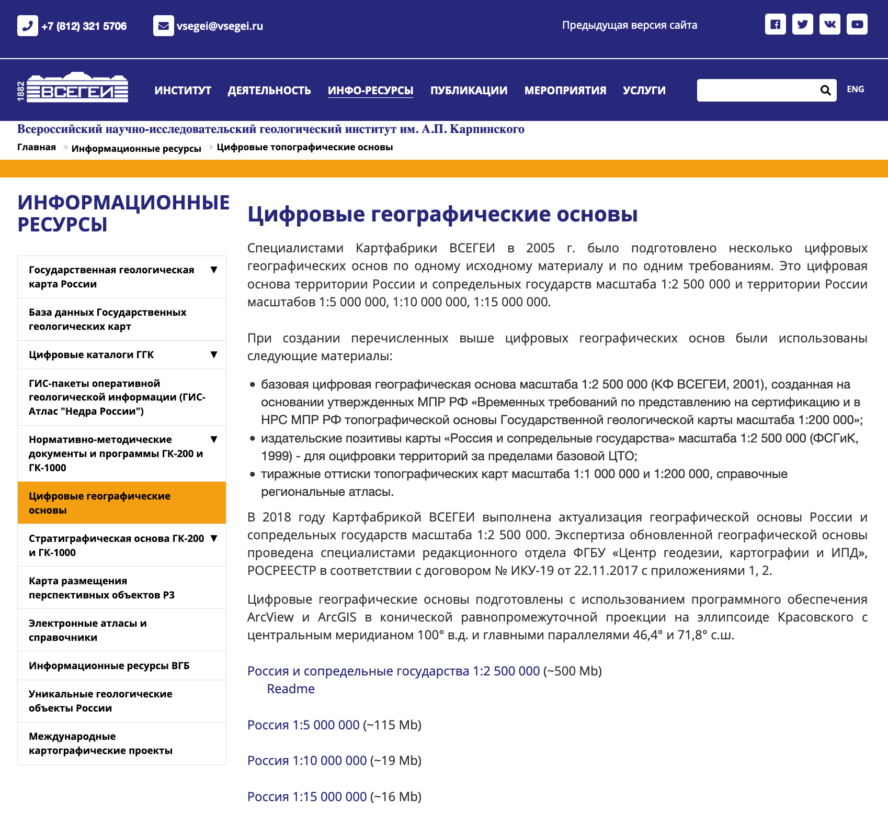
```
]

.pull-right[
- Масштабы 2.5, 5, 10, 15 млн

- Подходят для создания карт крупных регионов и макрорегионов России

- Не включают территории соседних государств

- Актуальность следует проверить
]

[https://vsegei.ru/ru/info/topo/](https://vsegei.ru/ru/info/topo/)

---

## Базовые картографические данные

### ВСЕГЕИ — Мелкомасштабные (Россия, крупные регионы)

```{r, out.width = "70%", fig.cap=""}
knitr::include_graphics("img/vsegei25.png")
```
---

## Базовые картографические данные

### ВСЕГЕИ — Мелкомасштабные (Россия, крупные регионы)

```{r, out.width = "70%", fig.cap=""}
knitr::include_graphics("img/vsegei25_det.png")
```

---

## Базовые картографические данные

### ? — Среднемасштабные

- .red[Готовых источников пространственных данных __открытого доступа__ для решения задач _регионального уровня_ нет].

- Карты масштабов 1:100 000 и 1:200 000, подходящие для решения таких задач, можно запросить в ЦКГФ — центральном картографо-геодезическом фонде (подчиняется ЦГКиИПД Росреестра).

- В качестве альтернативы можно поручить профессиональному картографу выполнить __генерализацию__ данных OpenStreetMap

---

## Базовые картографические данные

### Dataplus — Среднемасштабные (коммерческие)

.pull-left[
```{r, out.width = "80%", fig.cap=""}
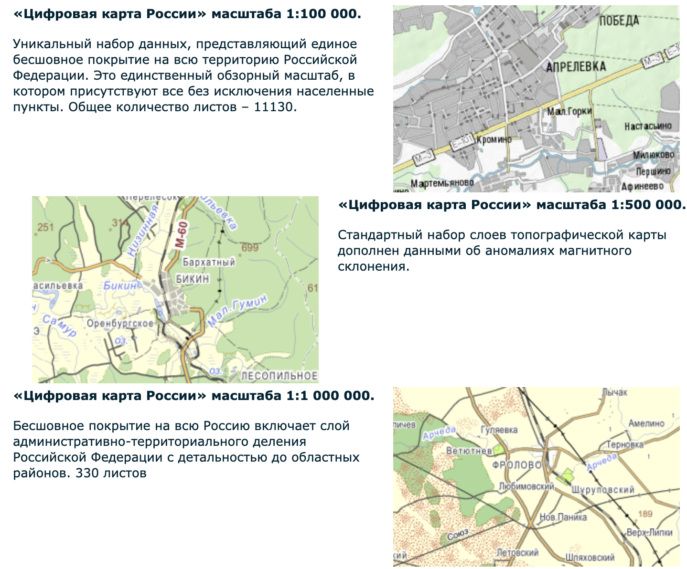
```
]

.pull-right[
- Масштабы 100, 500, 1000k

- Подойдут для задач регионального уровня

- Масштабы 500 и 1000 легко поддерживаются актуальными
]

[https://www.dataplus.ru/products/map_and_services_date/detail/review/](https://www.dataplus.ru/products/map_and_services_date/detail/review/)

---

## Базовые картографические данные

### OpenStreetMap — крупномасштабные (муниципалитеты)

.pull-left[
```{r, out.width = "90%", fig.cap=""}
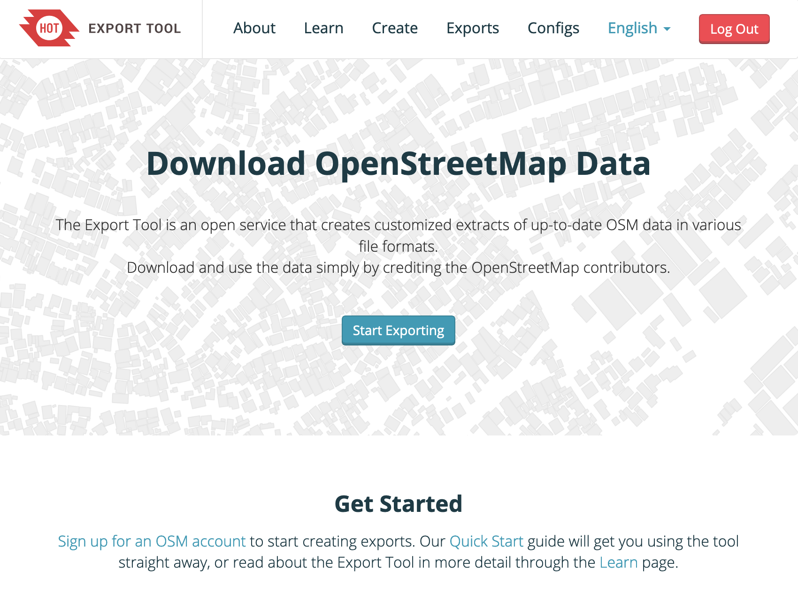
```
]

.pull-right[
- На урбанизированные территории детализация соответствует топографическим планам городов 

- Подойдут для задач муниципального уровня

- Постоянное обновление, доступ к данным
]

[https://www.openstreetmap.org/](https://www.openstreetmap.org/)
[https://export.hotosm.org/en/v3/](https://export.hotosm.org/en/v3/)

---

## OpenStreetMap

```{r, echo=FALSE}
library(leaflet)
library(magrittr)

leaflet(width = 1000) %>% 
  addTiles() %>% 
  setView(82.9102, 55.0074, zoom = 13)
```

---
class: center, middle, inverse
# Тематические карты

---

## Графические переменные

```{r, out.width = "60%", fig.cap=""}
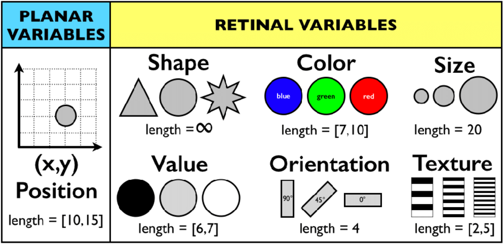
```

.small[Sauvage-Thomase, C., Biri, N., Perrouin, G., Genon, N., Heymans, P., 2017. Feature-Based Elicitation of Cognitively Efficient Visualizations for SPL Configurations, in: Sottet, J.-S., García Frey, A., Vanderdonckt, J. (Eds.), Human Centered Software Product Lines. Springer International Publishing, Cham, pp. 107–129. https://doi.org/10.1007/978-3-319-60947-8_4]

---

## Графические переменные

```{r, out.width = "85%", fig.cap=""}
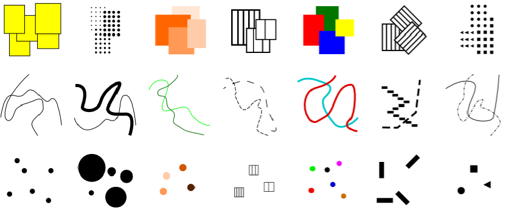
```

.small[Krassanakis, Vassilios & Mitropoulos, Vasilis & Nakos, Byron. (2013). A cartographic approach of the process of map symbolization on gvSIG software.]

---

## Шкалы измерения показателей

.left-column[
- Номинальная

- Порядковая

- Интервальная

- Абсолютная (отношений)
]
.right-column[
```{r, out.width = "70%", fig.cap=""}
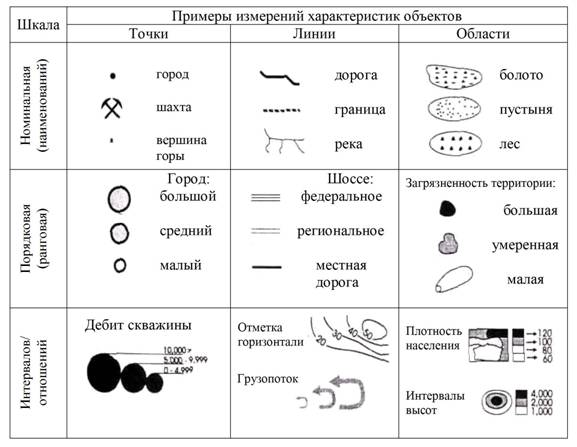
```
]

[http://gis.web.tstu.ru/metodic/gis/terminpon/glava2_3.html](http://gis.web.tstu.ru/metodic/gis/terminpon/glava2_3.html)

---
class: center, middle
# Визуализация данных

## .red[Переменные данных] $\rightarrow$ .blue[Графические переменные]

---

## Цвет

```{r, out.width = "65%", fig.cap=""}
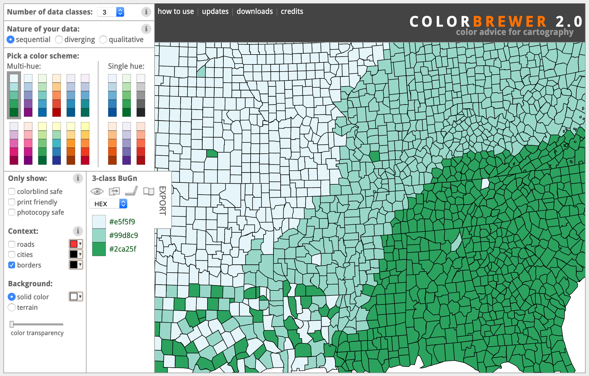
```

[http://colorbrewer2.org/](http://colorbrewer2.org/)

---

## Качественные (номинальные) показатели

Отношение порядка не установлено

```{r, out.width = "50%", fig.cap=""}
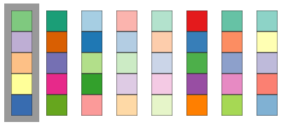
```

Используются цвета одинаковой светлоты и насыщенности, но разного тона.

- Тип землепользования, национальный язык, политико-административная принадлежность

---

## Количественные показатели

.pull-left[
### Униполярные

Без нейтрального значения

```{r, out.width = "100%", fig.cap=""}
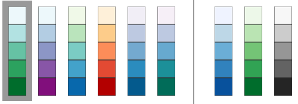
```
_Последовательные_ цветовые шкалы

- Кол-во авто на душу населения, объем капитального строительства

]

.pull-right[
### Биполярные

С нейтральным значением

```{r, out.width = "87%", fig.cap=""}
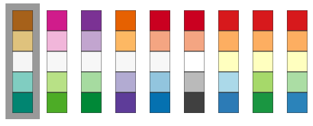
```
_Расходящиеся_ цветовые шкалы

- Сальдо миграций, естественный прирост, изменение ВВП

]

---

## Размер

```{r, out.width = "60%", fig.cap=""}
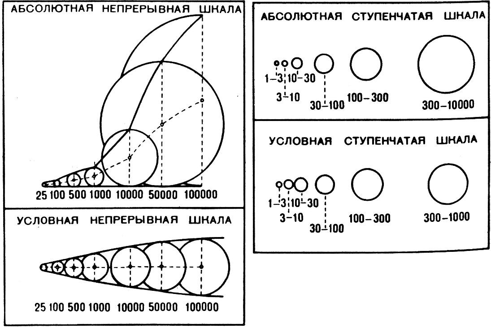
```

.small[Берлянт А.М., 2014. Картография, 4-е изд. КДУ, Москва.]

---
class: center, middle, inverse
# Присоединение тематических данных
